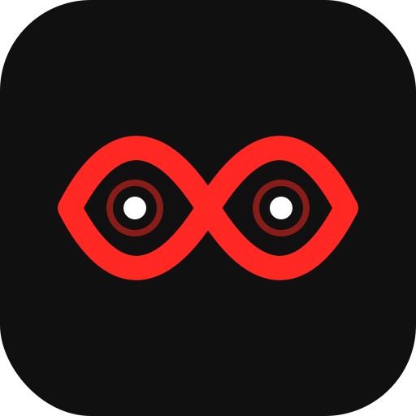

<p align="center">
  <strong>简体中文</strong> · <a href="README.en.md">English</a>
</p>

<p align="center">
  
</p>

<h1 align="center">Codex IP Theme</h1>

<p align="center">
  <strong>把你的 IP，变成真正能工作的 Codex 工作台。</strong><br>
  上传角色图和场景图，让 Codex 自动完成抠图、首页 Hero、原生控件适配、双平台启动器与验证截图。
</p>

<p align="center">
  <code>macOS</code> · <code>Windows</code> · <code>原生控件可交互</code> · <code>动态换图</code> · <code>不改 app.asar</code>
</p>

<p align="center">
  <a href="#三步做出你的主题"><strong>立即开始</strong></a> ·
  <a href="docs/showcase/tu-xing-ren.zh-CN.md">查看完整案例</a> ·
  <a href="docs/tutorial.zh-CN.md">操作教程</a>
</p>

> 社区项目，不是 OpenAI 官方产品。主题通过仅限本机的运行时注入实现，不修改 Codex 安装包、代码签名、登录状态、API Key 或模型供应商配置。

## 先看效果

下面不是概念稿，也不是盖在窗口上的假截图，而是运行在真实 Codex 桌面端中的凸星人旗舰主题。


原生建议卡、项目选择器、输入框和导航仍然可以操作；同一套 IP 也会延续到任务页。

<details>
<summary><strong>展开查看任务页效果</strong></summary>


</details>

## 它到底帮你做什么

| 你提供 | Skill 自动完成 | 你最终得到 |
|---|---|---|
| 一张角色图 | 识别角色、裁切动作、移除白底/纯色底 | 透明侧栏角色和输入框角色 |
| 可选的横版场景图 | 保留完整背景、建立文字遮罩、组合首页 Hero | 有品牌识别的完整首页工作台 |
| 一句主题要求 | 生成配色、文案、布局和响应式规则 | 可继续编辑的主题配置与 CSS |
| 无需手动找应用文件 | 生成并校验平台启动脚本 | macOS `.command` + Windows `.cmd` |
| 真实 Codex 页面 | 检查首页、任务页、重载和页面溢出 | 验证报告与实机截图 |

一张角色图就能开始；再加一张横版场景图，就能升级为完整的旗舰首页。

## 三步做出你的主题

### 1. 安装 Skill

直接在 Codex 中发送：

```text
请从 https://github.com/MSNirvana/codex-ip-theme 安装这个 Skill。
```

安装完成后重新打开 Codex，或者新建一个任务。

<details>
<summary>手动安装方式</summary>

macOS / Linux：

```bash
git clone https://github.com/MSNirvana/codex-ip-theme.git ~/.codex/skills/codex-ip-theme
```

Windows PowerShell：

```powershell
git clone https://github.com/MSNirvana/codex-ip-theme.git "$HOME\.codex\skills\codex-ip-theme"
```

</details>

### 2. 上传图片，告诉 Codex 你想要什么

只有一张角色图时：

```text
使用 $codex-ip-theme，把这张角色图制作成 Mac 和 Windows 都能使用的 Codex 主题，自动抠掉白底，并生成验证截图。
```

有角色设定图和横版场景图时：

```text
使用 $codex-ip-theme。第一张是角色设定图，请选择并抠出一个完整动作；第二张横版图作为首页 Hero，保留完整背景。生成 Mac 和 Windows 都能使用的旗舰主题，并验证原生卡片、项目选择器、输入框、任务页可读性和响应式布局。
```

主题名、强调色、标题文案和角色位置都可以不填，Skill 会根据图片先做一版完整方案。

### 3. 启动主题

生成完成后，先保存任务并完全退出 Codex：

| 平台 | 启动方式 | 运行要求 |
|---|---|---|
| macOS | 双击 `启动主题.command` | 保持终端窗口运行 |
| Windows | 双击 `启动主题.cmd` | 保持命令窗口运行 |

看到 `[injected]` 后主题即已生效。按 `Command/Ctrl + Shift + L` 可以临时切换原版与主题版。

## 为什么它不只是“换个背景色”

- **原生界面继续工作**：建议卡、项目选择器、输入框、侧栏和导航都来自真实 Codex DOM。
- **角色和场景分开处理**：角色图自动抠成透明 PNG；横版 Hero 保留完整背景，不会被错误抠图。
- **首页和任务页是两套策略**：首页强化品牌，任务页只保留低透明度氛围，不牺牲文字和代码可读性。
- **图片随时能换**：角色图、Hero、配置和 CSS 保存后约两秒自动重载。
- **不是一次性演示稿**：生成的是独立主题项目，可以继续修改、迁移和复用。
- **验证不是一句“成功了”**：会检查原生控件、路由切换、重载恢复、宽窄窗口和横向溢出。

## 案例：凸星人旗舰工作台

这个案例使用角色设定图和 16:9 GGOO 场景图，完成了：

| 设计目标 | 实际结果 |
|---|---|
| 首页品牌化 | 横版场景成为 650px Hero，左侧标题保持清晰 |
| IP 识别 | 红色无限眼、黑白红配色、侧栏与输入框角色联动 |
| 原生交互 | 4 张建议卡、项目选择器、输入框和导航可正常操作 |
| 任务可读性 | 同场景以 `0.12` 透明度进入任务页，不遮挡正文 |
| 响应式 | 实测 1180、900、640px，无横向溢出 |
| 重载恢复 | 页面重载后自动恢复主题 |

[查看凸星人完整案例、任务页截图和设计拆解 →](docs/showcase/tu-xing-ren.zh-CN.md)

## 生成后你会拿到什么

```text
你的主题项目/
├── assets/
│   ├── ip-sidebar.png       # 透明侧栏角色
│   ├── ip-composer.png      # 透明输入框角色
│   └── ip-hero.png          # 完整横版场景
├── theme/
│   ├── config.json          # 配色、文案、尺寸和透明度
│   └── theme.css            # 首页、卡片、侧栏和任务页样式
├── 启动主题.command / .cmd
├── 验证主题.command / .cmd
├── 移除主题.command / .cmd
└── ip-transparency-preview.png
```

它不会把文件写进 `app.asar`，也不需要重新签名官方应用。

## 动态换图

主题运行时可以继续上传新图片并告诉 Codex：

```text
使用 $codex-ip-theme，把这个主题的首页 Hero 替换成新上传的横版图片，保留其他配色和角色。
```

支持替换 `sidebar`、`composer`、`both`、`hero` 或 `all`，无需重新打包 Codex。

## 文档入口

- [中文完整操作教程](docs/tutorial.zh-CN.md)
- [凸星人旗舰主题案例](docs/showcase/tu-xing-ren.zh-CN.md)
- [常见问题与排错](references/troubleshooting.md)
- [安全说明](SECURITY.md)
- [参与贡献](CONTRIBUTING.md)
- [English README](README.en.md)

## 兼容性与边界

- macOS：官方 Codex/ChatGPT 桌面端，bundle identifier 为 `com.openai.codex`。
- Windows：OpenAI Codex 桌面安装包或 Store 版；脚本会自动发现安装路径。
- 默认抠图适合白色、灰色或近似纯色背景；复杂摄影背景需要额外分割工具。
- Codex 大版本更新后，页面选择器可能需要维护。
- Windows 脚本已完成静态检查，具体设备仍应进行实机验证。
- 调试接口只绑定 `127.0.0.1`，不要改为 `0.0.0.0`。

## 许可证与致谢

代码使用 [MIT License](LICENSE)。用户上传的原始图片仍归原权利人所有，本仓库不包含凸星人原始素材。案例截图仅用于展示实际效果，其中出现的凸星人/GGOO 视觉资产不随 MIT 许可证再授权，详见 [NOTICE.md](NOTICE.md)。

运行时架构参考并对标了 MIT 许可的 [Fei-Away/Codex-Dream-Skin](https://github.com/Fei-Away/Codex-Dream-Skin)，但主题生成流程、图片处理、旗舰 Hero、动态换图、验证器和跨平台项目结构均为本项目独立实现。

---

<p align="center">
  <strong>别让你的 IP 只停在一张图里。把它变成每天都在使用的 Codex 工作台。</strong>
</p>
