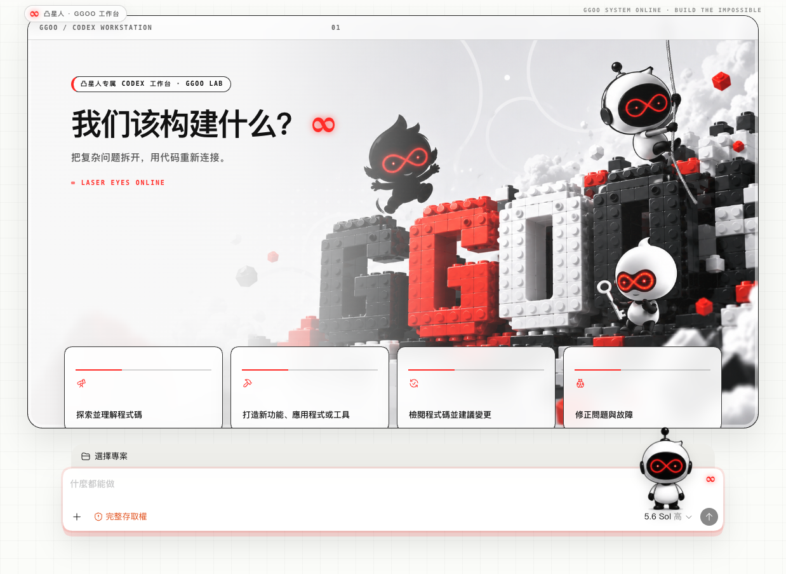
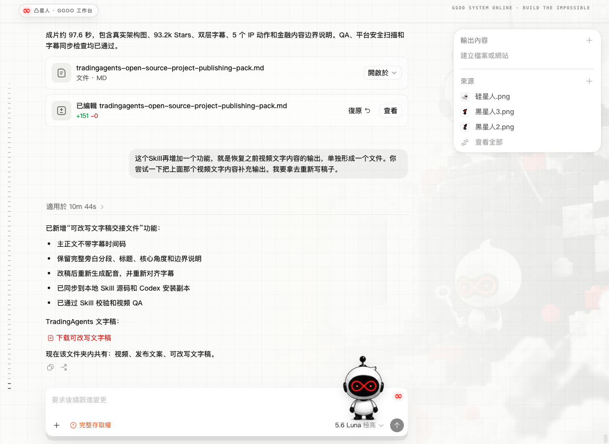

# 案例：凸星人旗舰 Codex 主题

[返回中文首页](../../README.md) · [English case study](tu-xing-ren.en.md)

这是 `codex-ip-theme` 的首个完整旗舰案例。目标不是给原界面换一组颜色，而是让凸星人的视觉识别进入 Codex 首页、建议卡、输入框、侧栏和任务页，同时保留所有原生交互。

> 案例仓库只收录运行截图，不包含凸星人原始角色图和场景素材。

## 最终效果

### 首页工作台



首页使用完整横版 GGOO 场景作为 Hero。左侧通过白色渐变建立文案区，右侧保留角色、积木结构和红色无限眼；4 张原生建议卡位于 Hero 底部，仍然可以直接点击。

### 任务页



任务页复用同一场景，但透明度降至 `0.12`，并增加白色遮罩。消息、文件卡、差异内容、右侧面板和输入框仍保持原生可读性。

## 从素材到主题

| 阶段 | 输入/处理 | 结果 |
|---|---|---|
| 角色提取 | 从角色设定表裁出完整站立动作，使用边缘连通抠图 | 保留白色身体和黑色轮廓，输出透明 PNG |
| Hero 场景 | 直接保留 16:9 场景背景，不执行抠图 | GGOO 场景完整进入首页 |
| 首页布局 | 识别真实首页路由和原生建议区 | Hero、建议卡、项目选择器和输入框组成统一工作台 |
| 任务页 | 使用独立路由类和低透明度壁纸 | 品牌延续，但不降低正文对比度 |
| 动态更新 | 配置、CSS、角色图、Hero 图共同参与哈希 | 保存后约 2 秒热更新，无需重新打包应用 |

## 本次沉淀的关键优化

1. **角色图和 Hero 分开处理。** 角色图需要透明背景；横版场景必须保留完整背景，不能共用同一套抠图流程。
2. **围绕真实 DOM 设计。** 主题只添加非交互装饰和路由类，不用整窗截图覆盖 Codex，也不复制假的按钮。
3. **首页与任务页状态互斥。** 路由变化时使用 `classList.toggle` 清理旧状态，避免同一个页面同时残留首页和任务壁纸类。
4. **选择器提供语义兜底。** 首页通过 `home-icon` / `game-source` 判断；项目选择器同时支持类名和 `data-composer-navigation-target="workspace-project"`。
5. **用实测边界修复重叠。** Codex 原生布局带有负边距；通过检查真实元素坐标，取消会把输入框拉进卡片区的负边距。
6. **响应式优先保护交互。** 宽屏使用 4 列卡片，中窄屏降为 2 列；空间不足时先隐藏装饰角色，不压缩原生按钮和输入框。
7. **验证器理解首页结构。** 除了检查注入成功，还检查 Hero、2–6 张原生建议卡、项目选择器、输入框、侧栏和横向溢出。

这些规则已经写入 Skill 的 `references/flagship-patterns.md`，后续生成其他 IP 主题时可以直接复用。

## 实机验证

| 检查项 | 结果 |
|---|---|
| Hero 可见区域 | `1152 × 650` |
| 原生建议卡 | 4 张，全部可见并可点击 |
| 项目选择器 | 可见并保留原生菜单 |
| 输入框 | 可见、可聚焦、原生权限和模型控件保留 |
| 任务页 | 壁纸可见，正文和文件卡清晰 |
| 页面重载 | 自动恢复主题 |
| 响应式 | 1180 / 900 / 640px 无横向溢出 |
| 装饰层 | `pointer-events: none`，不拦截操作 |

Windows 启动器和脚本已完成静态校验；当前案例截图来自 macOS 实机。

## 复用这个方案

上传角色图和横版场景图后，可以直接使用：

```text
使用 $codex-ip-theme。第一张图是角色设定，请选择并抠出一个完整动作；第二张横版图作为首页 Hero，保留完整背景。生成 Mac 和 Windows 都能使用的旗舰主题，并验证首页原生卡片、项目选择器、输入框、任务页可读性和响应式布局。
```
